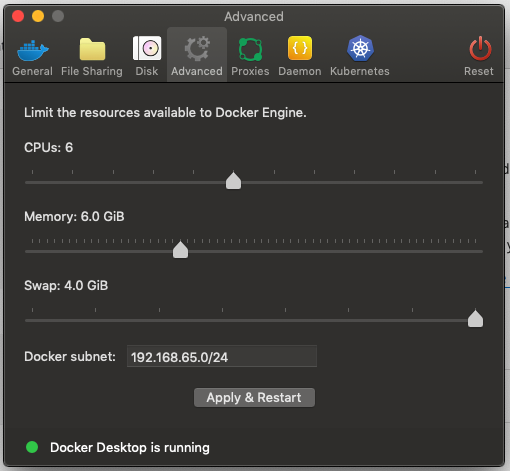

# Pantheon
## Local Development
### Requirements for development
- Create an SSH key to use Git without signing in: https://pantheon.io/docs/ssh-keys
- Generate a Machine token to connect Terminus to the remote sites: https://pantheon.io/docs/machine-tokens
### GUI (Pantheon LocalDev)
Download the LocalDev GUI for Pantheon. This allows for local development, but with a more user friendly approach. [Download LocalDev](https://pantheon.io/localdev)
 
*note: make sure that Docker version is 2.1.0* 
 

 
## Setting up Pantheon Local Development
## Code Management
## Site Management
## Terminus
## Build Tools
## Docker and Lando (see below)
